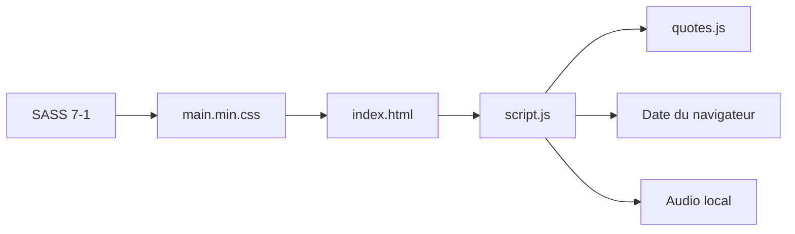
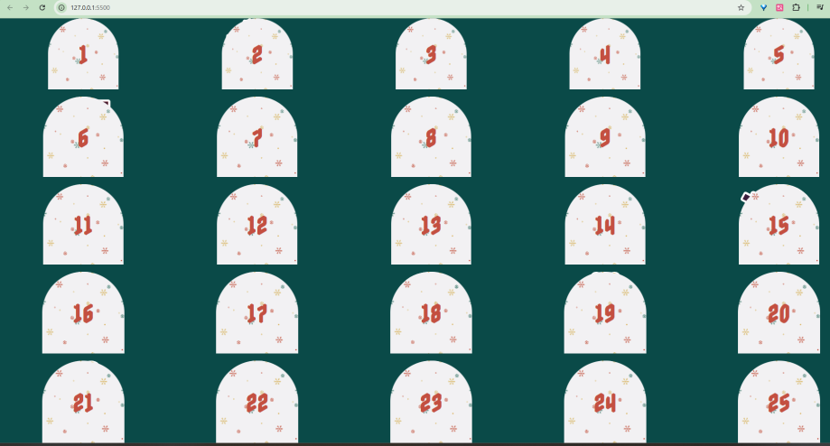
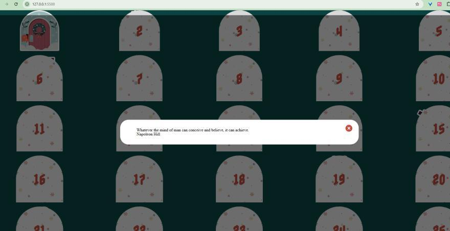
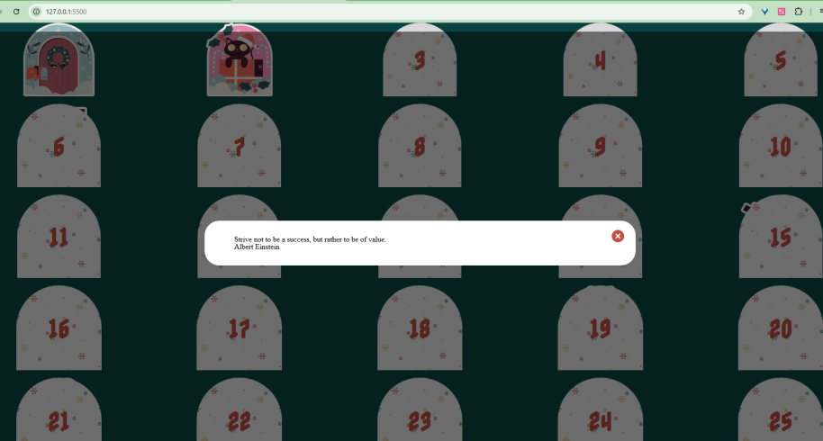

# Calendrier de l'Avent interactif

<p align="center">
  Expérience front-end responsive en HTML, SASS et JavaScript vanilla :
  25 cases, révélations progressives, citations et ambiance sonore.
</p>

<p align="center">
  
  
  
  
</p>

> **English summary:** A responsive Advent calendar built with semantic HTML,
> modular SASS and vanilla JavaScript. Available days reveal an illustration,
> play an audio cue and open an accessible native dialog with a quotation.

## Le projet en 30 secondes

L'utilisateur découvre une grille de 25 cases. Une case correspondant à une date
déjà atteinte peut être ouverte : son illustration apparaît, une musique est
jouée et une citation est présentée dans une fenêtre modale. Le projet met
l'accent sur l'architecture SASS 7-1, le DOM, les modules JavaScript et le
responsive design.

## Fonctionnalités

- génération visuelle de 25 jours ;
- verrouillage des jours futurs selon la date du navigateur ;
- illustration différente pour chaque case ;
- lecture d'un effet sonore à l'ouverture ;
- citation et auteur affichés dans un élément natif `<dialog>` ;
- styles SASS organisés par responsabilités ;
- mise en page responsive.

## Architecture



## Démarrage rapide

```bash
git clone https://github.com/EngGhada/Calendrier-.git
cd Calendrier-
python -m http.server 8000
```

Ouvrez `http://localhost:8000`. Le CSS compilé est déjà versionné ; SASS n'est
nécessaire que pour modifier les styles.

## Aperçu

<table>
  <tr>
    <td width="50%"><br><strong>Grille initiale</strong></td>
    <td width="50%"><br><strong>Révélation d'une case</strong></td>
  </tr>
  <tr>
    <td colspan="2"><br><strong>Citation affichée dans la fenêtre modale</strong></td>
  </tr>
</table>

Ces captures authentiques proviennent du dossier professionnel du projet.

## Structure

```text
.
├── index.html
├── assets/
│   ├── audios/            # Ambiance sonore
│   ├── css/               # CSS compilé et source map
│   ├── fonts/             # Police locale
│   ├── images/            # Illustrations des 25 cases
│   └── js/                # Interaction et citations
├── sass/
│   ├── abstracts/         # Variables et mixins
│   ├── base/              # Reset et polices
│   ├── components/        # Cases et fenêtre modale
│   └── page/              # Mise en page du calendrier
└── docs/
```

## Documentation

- [Architecture](docs/ARCHITECTURE.md)
- [Installation et compilation SASS](docs/SETUP.md)
- [Sécurité, accessibilité et limites](docs/SECURITY.md)
- [Audit du dépôt](docs/PROJECT_AUDIT.md)

## Feuille de route

- [ ] mémoriser les cases ouvertes dans `localStorage` ;
- [ ] ajouter un mode démonstration indépendant de la date ;
- [ ] renforcer la navigation clavier et les annonces ARIA ;
- [ ] ajouter des tests sur la règle d'ouverture ;
- [ ] automatiser la compilation SASS.

## Auteur

Projet réalisé par [EngGhada](https://github.com/EngGhada).
