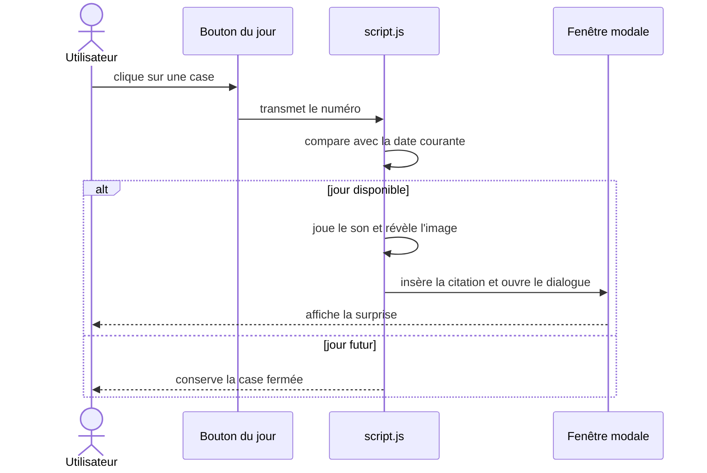

# Architecture du Calendrier de l'Avent

## Organisation front-end

Le projet utilise des fichiers statiques et un module JavaScript principal.
`index.html` fournit les 25 boutons et le composant `<dialog>`. `script.js`
orchestre les interactions et importe les citations depuis `quotes.js`.

## Flux d'une interaction

## Architecture SASS 7-1

- `abstracts/` : variables et mixins réutilisables ;
- `base/` : resets et déclaration des polices ;
- `components/` : calendrier et fenêtre modale ;
- `page/` : composition générale de la page ;
- `main.sass` : point d'entrée qui assemble les modules.

Le CSS minifié généré est versionné afin que le projet fonctionne sans étape de
build pour une simple démonstration.
